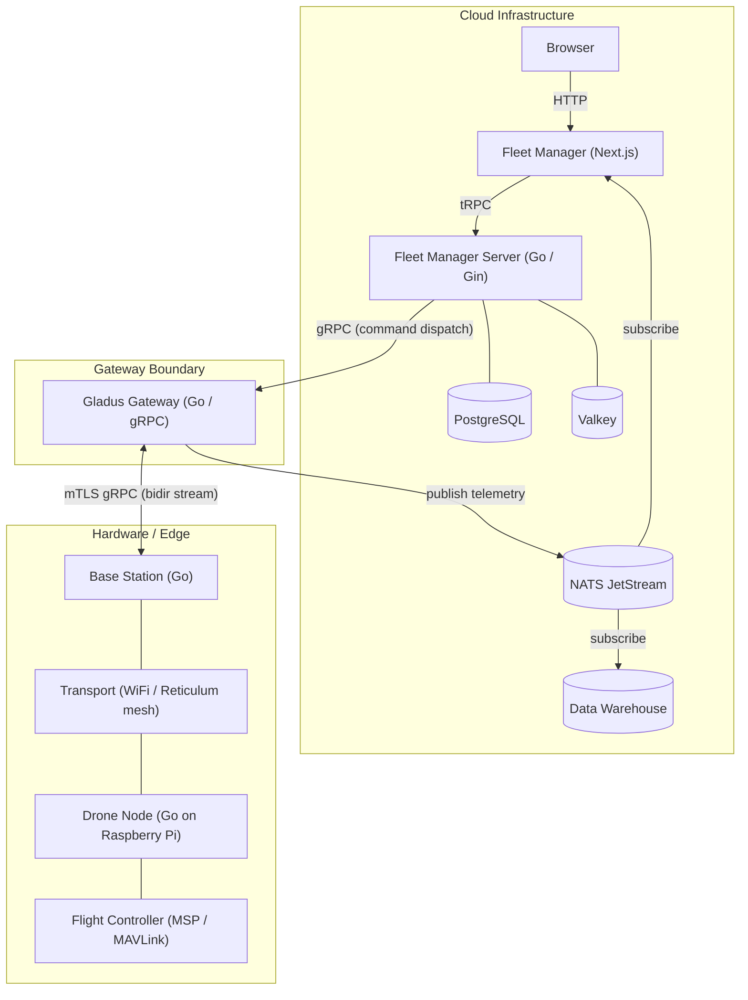

# VECTR

A platform for drone fleet management, real-time telemetry, and autonomous operations.

## Architecture

**Gladus** is the gateway boundary — everything above it is cloud infrastructure, everything below is hardware.

### Data flows

- **Telemetry** (high frequency): FC → Node → Base → Gateway → NATS JetStream → Fleet Manager (real-time) + Data Warehouse (storage)
- **Commands**: Browser → Fleet Manager → FMS → Gateway → Base → Node → FC
- **Acknowledgments**: Node → Base → Gateway → FMS

## Repositories

| Repo | Stack | Description |
|------|-------|-------------|
| [fleet-manager](https://github.com/vectr-ch/fleet-manager) | Next.js 16, React 19, Tailwind, tRPC | Web dashboard for fleet operators. Dark-themed UI with real-time maps, telemetry, and fleet management. |
| [fleet-manager-server](https://github.com/vectr-ch/fleet-manager-server) | Go, Gin, GORM, PostgreSQL, Valkey | Central platform API. Multi-tenant RBAC, device enrollment PKI, mTLS certificate lifecycle, MFA/TOTP. |
| [gladus](https://github.com/vectr-ch/gladus) | Go, gRPC, NATS JetStream, Prometheus | Gateway service. Bridges cloud to hardware via mTLS bidirectional streams. Publishes telemetry to NATS, routes commands to base stations. |
| [proto](https://github.com/vectr-ch/proto) | Protobuf, buf | Single source of truth for all message and gRPC service definitions. Generated Go code consumed by all Go services. |
| [edge](https://github.com/vectr-ch/edge) | Go, gRPC, MSP, MAVLink | On-device binaries. `node/` runs on drones (Raspberry Pi, ARM64), `base/` runs on ground stations. Pluggable transport layer (UDP, VectRNet/Reticulum mesh). |
| [terragen](https://github.com/vectr-ch/terragen) | Docker Compose, OpenTofu, GitHub Actions | Infrastructure, CI/CD pipelines, and deployment configs. |

## Hardware

| Role | Hardware |
|------|----------|
| Flight controller | Betaflight FC, iNav FC, ArduPilot (Pixhawk / CubeOrange) |
| On-board computer | Raspberry Pi (planned upgrade to Jetson for on-board inference) |
| Wireless link | WiFi via Reticulum mesh (VectRNet) |
| Base station | Linux machine with WiFi antenna |

## Roadmap

| Phase | Focus |
|-------|-------|
| 1 | Manual remote control with real-time stick inputs |
| 2 — now | Multi-FC support (ArduPilot MAVLink, iNav MSPv2), fleet management platform, waypoint missions, GPS-guided flight |
| 3 | Autonomous operation with on-board inference |
